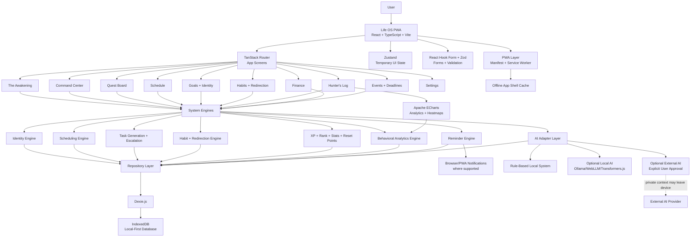
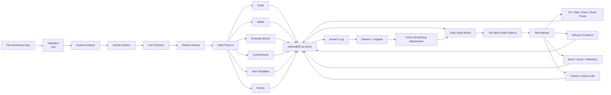
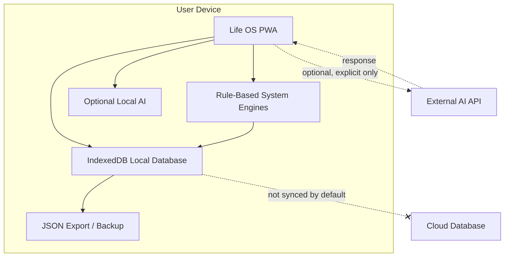
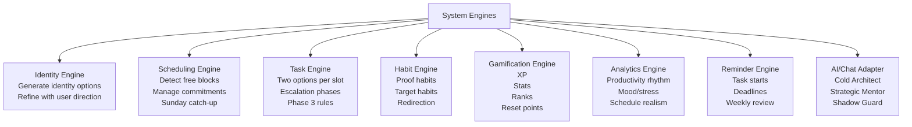

# The System: Life OS - Architecture Diagram

This document shows the planned v1 architecture for Life OS. It is based on:

- `LIFE_OS_CONCEPT.md`
- `LIFE_OS_V1_BLUEPRINT.md`
- `LIFE_OS_IMPLEMENTATION_PLAN.md`

## 1. High-Level Architecture

## 2. Data Flow

## 3. Local-First Privacy Boundary

## 4. Main Engine Responsibilities

## 5. First-Build Architecture Notes

- The app is local-first: sensitive data stays in IndexedDB by default.
- The PWA layer makes Life OS installable and caches the app shell.
- System engines should be pure TypeScript where possible so they are easy to test.
- UI screens should call repositories and engines, not contain business rules directly.
- External AI is optional and explicit. Core scheduling, XP, rank, reset points, and Phase 3 rules must work without external AI.
- Hunter's Log should read from behavioral evidence, task attempts, mood/stress entries, finance entries, and schedule history.

